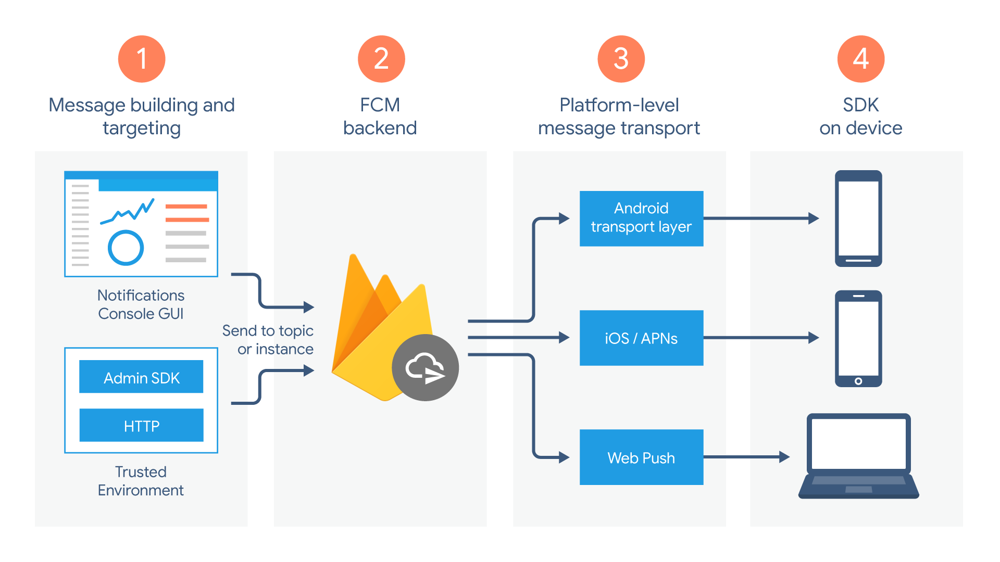

# Usar Firebase Cloud Messaging (FCM) 

Es un servicio de mensajería multiplataforma desarrollado por Google.
Permite enviar mensajes y notificaciones de forma fiable y gratuita a dispositivos Android, iOS y aplicaciones web.

- ¿Para qué se utiliza?

Notificaciones push: Enviar alertas a los usuarios sobre nuevas actualizaciones, mensajes, promociones, etc., incluso cuando la aplicación no está en uso.

- Mensajes de datos: Transmitir datos entre servidores y aplicaciones, lo que permite actualizar la información en tiempo real.

- Mensajes de temas: Enviar mensajes a grupos de usuarios que se han suscrito a un tema específico.

- ¿Cómo funciona?

El servidor de la aplicación envía un mensaje a los servidores de FCM.
FCM entrega el mensaje a los dispositivos de los usuarios.
La aplicación en el dispositivo recibe el mensaje y puede mostrar una notificación o realizar otras acciones.

- Ventajas:

Gratuito: No hay costos asociados con el uso de FCM.
Multiplataforma: Funciona en Android, iOS y web.
Fiable: Google garantiza la entrega de los mensajes.
Escalable: Puede manejar grandes volúmenes de mensajes.

fuentes : (https://firebase.google.com/docs/flutter/setup?platform=ios)

tambien puede consultar (doc/)