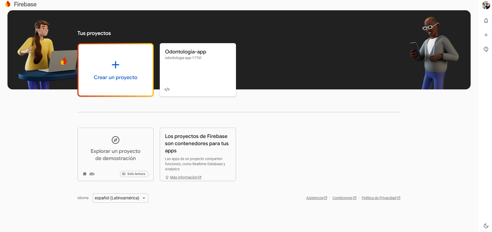

# Integrar Firebase Cloud Messaging (FCM)

en el proyecto Flutter con Riverpod es una excelente idea para manejar notificaciones push. A continuación mostrare, paso a paso para crear una pequeña demo que permita entender cómo funciona FCM y cómo integrarlo en el proyecto.

## Paso 1: Configura Firebase en el proyecto Flutter

Crea un proyecto en Firebase:

Ve a la consola de Firebase.

- Crea un nuevo proyecto.



Agrega Firebase a la aplicación Flutter:

En la consola de Firebase, selecciona "Agregar aplicación" y elige la plataforma (Android, iOS, o ambas).

Sigue las instrucciones para agregar el archivo de configuración (google-services.json para Android y GoogleService-Info.plist para iOS) a tu proyecto Flutter.

Agrega las dependencias necesarias en pubspec.yaml:

```yaml
dependencies:
  flutter:
    sdk: flutter
  firebase_core: latest_version
  firebase_messaging: latest_version
  flutter_riverpod: latest_version
```

Inicializa Firebase en tu aplicación:
En tu archivo main.dart, inicializa Firebase antes de ejecutar la aplicación:

```dart

import 'package:firebase_core/firebase_core.dart';
import 'package:flutter/material.dart';

void main() async {
  WidgetsFlutterBinding.ensureInitialized();
  await Firebase.initializeApp();
  runApp(MyApp());
}

class MyApp extends StatelessWidget {
  @override
  Widget build(BuildContext context) {
    return MaterialApp(
      title: 'FCM Demo',
      home: HomeScreen(),
    );
  }
}

```

## Paso 2: Configura Firebase Cloud Messaging

Configura FCM en Firebase:

En la consola de Firebase, ve a "Cloud Messaging" y sigue las instrucciones para configurar FCM.

Maneja los mensajes en tu aplicación:

Crea un archivo fcm_service.dart para manejar la lógica de FCM:

```dart

import 'package:firebase_messaging/firebase_messaging.dart';
import 'package:flutter_riverpod/flutter_riverpod.dart';

final fcmServiceProvider = Provider<FcmService>((ref) => FcmService());

class FcmService {
  final FirebaseMessaging _firebaseMessaging = FirebaseMessaging.instance;

  Future<void> initialize() async {
    // Solicita permiso para notificaciones (solo en iOS)
    NotificationSettings settings = await _firebaseMessaging.requestPermission(
      alert: true,
      badge: true,
      sound: true,
    );

    if (settings.authorizationStatus == AuthorizationStatus.authorized) {
      print('User granted permission');

      // Obtén el token FCM
      String? token = await _firebaseMessaging.getToken();
      print("FCM Token: $token");

      // Escucha mensajes en primer plano
      FirebaseMessaging.onMessage.listen((RemoteMessage message) {
        print('Got a message whilst in the foreground!');
        print('Message data: ${message.data}');

        if (message.notification != null) {
          print('Message also contained a notification: ${message.notification}');
        }
      });

      // Maneja mensajes en segundo plano
      FirebaseMessaging.onBackgroundMessage(_firebaseMessagingBackgroundHandler);
    } else {
      print('User declined or has not accepted permission');
    }
  }

  static Future<void> _firebaseMessagingBackgroundHandler(RemoteMessage message) async {
    print("Handling a background message: ${message.messageId}");
  }
}

```

Inicializa el servicio FCM en tu aplicación:

En tu main.dart, inicializa el servicio FCM:

```dart

import 'package:flutter_riverpod/flutter_riverpod.dart';
import 'fcm_service.dart';

void main() async {
  WidgetsFlutterBinding.ensureInitialized();
  await Firebase.initializeApp();
  runApp(ProviderScope(child: MyApp()));
}

class MyApp extends StatelessWidget {
  @override
  Widget build(BuildContext context) {
    return MaterialApp(
      title: 'FCM Demo',
      home: HomeScreen(),
    );
  }
}

class HomeScreen extends ConsumerWidget {
  @override
  Widget build(BuildContext context, WidgetRef ref) {
    final fcmService = ref.read(fcmServiceProvider);

    // Inicializa FCM cuando se construye la pantalla
    WidgetsBinding.instance.addPostFrameCallback((_) {
      fcmService.initialize();
    });

    return Scaffold(
      appBar: AppBar(
        title: Text('FCM Demo'),
      ),
      body: Center(
        child: Text('Firebase Cloud Messaging Demo'),
      ),
    );
  }
}

```

## Paso 3: Prueba tu aplicación

Envía una notificación de prueba:

En la consola de Firebase, ve a "Cloud Messaging" y envía una notificación de prueba.

Asegúrate de que tu aplicación esté en primer plano y en segundo plano para ver cómo se manejan las notificaciones.

Verifica los logs:

Revisa los logs en la consola de tu IDE para ver los mensajes recibidos y el token FCM generado.

Paso 4: Integra FCM en tu proyecto principal
Una vez que hayas entendido cómo funciona FCM en la demo, puedes integrar la lógica en tu proyecto principal. Asegúrate de manejar correctamente los mensajes en primer y segundo plano, y de almacenar el token FCM en tu backend si es necesario para enviar notificaciones personalizadas.

Consideraciones adicionales
Manejo de notificaciones en segundo plano: Asegúrate de que tu aplicación maneje correctamente las notificaciones cuando está en segundo plano o cerrada.

Permisos en iOS: En iOS, es necesario solicitar permisos explícitos para mostrar notificaciones.

Token de FCM: El token FCM puede cambiar, así que asegúrate de actualizarlo en tu backend si es necesario.
